# Anatomy and Physiology Short Quiz

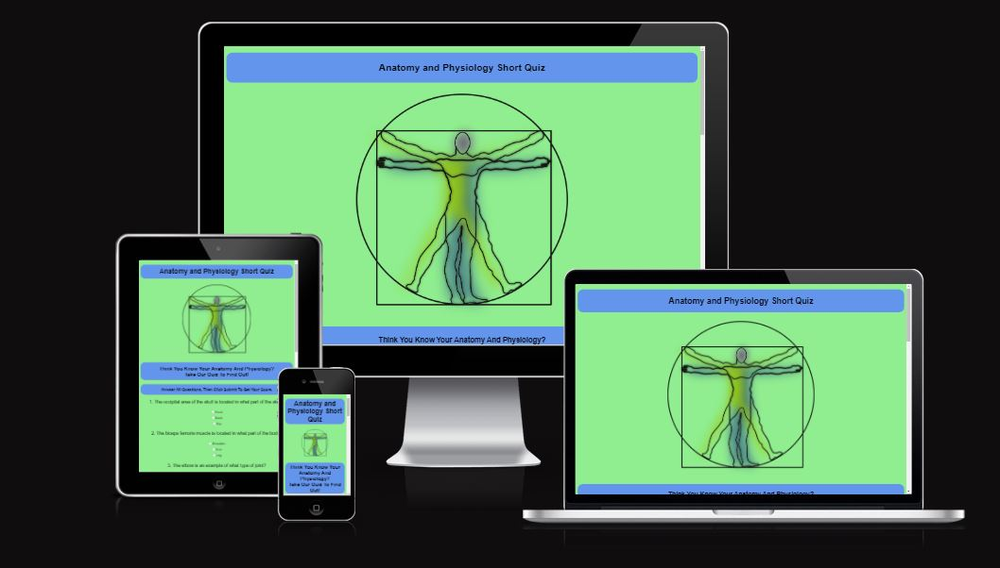

## Introduciton to the Quiz:

The quiz is a very simple in design 10 question quiz of moderately challenging anatomy and physiology questions. The quiz is designed to challenge students studying anatomy and/or physiology or for people interested in this subject.

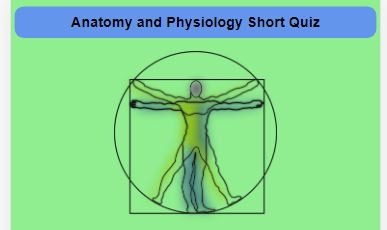

The quiz is designed to motivate the user if they did not receive the score they hoped for with a positive message that appears under their score after they submit their answers. Also the quiz is also designed to spur on and motivate users that scored 9 or more out of 10 answers correctly.

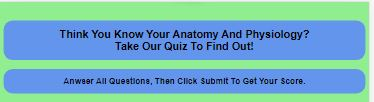

## Features:

### Quiz Questions

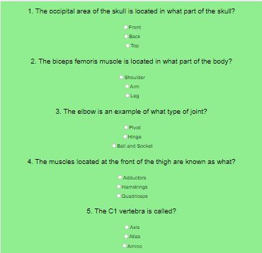

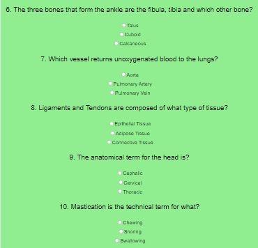

The quiz has 10 questions with 3 possible options to choose as an answer. The quiz has radio buttons that must be selected. The submit button will not allow submission of questions if a quiz has been left blank or missed by mistake.

### Submit Answers Area

At the end of the questions there is a submit answers button. This button has an event listener attached to it and when the scores are calculated, your score comes up (including the negative or incorrect out of 10 also). If the user scores 4 or less a motivational message pops up on screen as well as an image of being at the end of a concrete stairs and looking uopwards to the top of the stairs. If the user scores between 5 and 8 correct answers, another message pops up with a message to congratulate the user on a good score and an image of a young buy with a medal around his neck (as can be seen in the below image). If the user scores 9 or 10 they get a different message saying excellent score and an image of an elated woman holding a tablet.

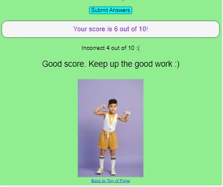

## Languages used

<ul>
<li>HTML</li>
<li>CSS</li>
<li>JavaScript</li>
</ul>

## Testing:

I confirm that the project is easy to understand. All are fonts are readable and good colour contrast throughout the quiz.

I confirm the website works in Chrome, Safari and Firefox.

I confirm that the project is responsive and works on all standard screen sizes using the dev tools device toolbar.

## Bugs:

Initially when I ran the html code there were errors and warnings. There was an error with regard to an id I had used on each of my input elements for the anwser options. I called all of the options (30 in total, 3 per question) qchoice. I was using this id to style the input elements. This showed up as an error. When I change all the qchoice to qchoice(1-10)a, b and c the error was solved.

I also got a recommendation to have a header in the section that holds the quiz questions. I added a h3 element and my accessibility score improved.

I had also forgotten to put and alt and a source on the image element in my html file for the images that appear after the submission button is clicked.

## Validator Testing:

### HTML

No errors or warnings were noted when passing through the official [W3C validator](https://validator.w3.org/#validate_by_input).

### CSS

No errors were noted when passing through the Jigsaw, [CSS offical validator](https://jigsaw.w3.org/css-validator/)

### JSHint

No errors were noted when passing through [JSHint](https://jshint.com/)

The following warnings were noted:

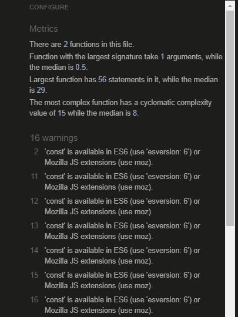

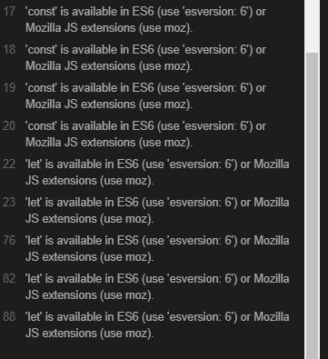

### Accessibility

I confirm that colors and fonts are easy to read and also that the accessiblity is high as can be seen in the below screenshot taken about it was ran through lighthouse in dev tools.

I received 2 different lighthouse scores as can be seen in the images below. One is from last night and the second is from this morning.

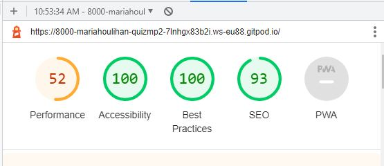

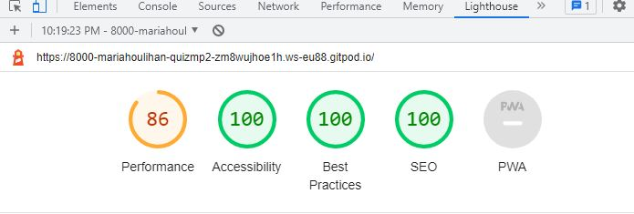

### Unfixed Bugs

There is an error in the console that I am unsure what it is or how to go about fixing it. See images below:

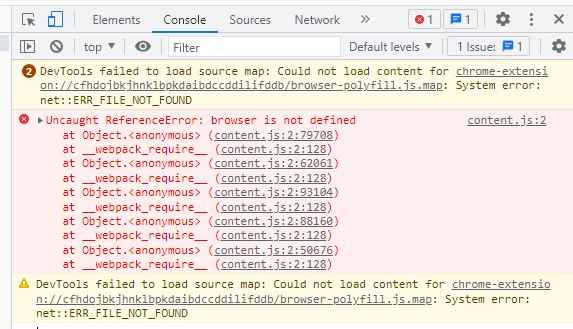

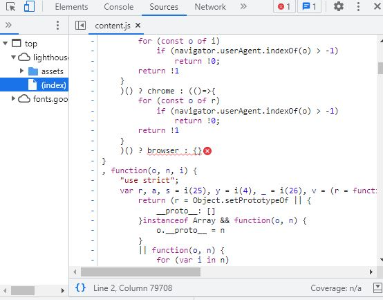

## Deployment:

The site was deployed to GitHub pages and the code is:

https://mariahoulihan.github.io/quiz-mp2/

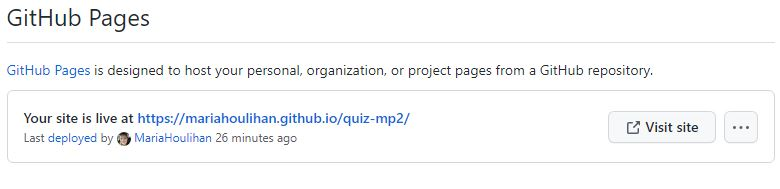

#### The deployment method is as follows:

I went to my repository for my project, the link is https://github.com/MariaHoulihan/quiz-mp2

I clicked settings in my repository. Next I selected Pages on the menu on the left hand side of the screen, which took me to GitHub pages. I clicked on Source and selected main from the drop down menu. Then I pressed save. It took a very long time to build and I was concerned about the deployment process. I contacted student support at [Code Institute](https://learn.codeinstitute.net) and the advisor told me to click another option in the dropdown menu beside main, which was docs. I did this and pressed save. The link then appeared and said that the site had went live 25 minutes prior to that time. refreshed the page and my site was live and the link is above in the screen shot and also in the text under deployment.

#### Forking the GitHub Repository

A copy of the original repositiory can be made by forking the GitHub Repository. The copy is made on the an individuals GitHub account, so that an individual (other than the author/creator) can view and make changes if desired without affecting the original repository. 

##### Steps to fork a Github Repository

<ol>
<li>Log in to GitHub and locate the GitHub Repository that is required to be forked.</li>
<li>Locate the "Fork" button at the top of the Repository, this can be found just above the "Settings" Button on the menu.</li>
<li>There should now be a copy of the original repository in your GitHub account.</li></ol>

##### Making a Local Clone

<ol>
<li>Log in to [GitHub](https://github.com/) and locate the [GitHub](https://github.com/) Repository that is required to be cloned.</li>
<li>Click "Clone or download" underneath the repository name.</li>
<li>To clone the repository using HTTPS, copy the link under "Clone with HTTPS".</li>
<li>Open Git Bash</li>
<li>Next, change the current working directory to the location of where the cloned directory will be made.</li>
<li>Type git clone, and then paste the URL you copied in Step 3 (the link under "Clone with HTTPS").</li>
<li>$ git clone https://github.com/YOUR-USERNAME/YOUR-REPOSITORY</li>
<li>Press Enter. The local clone will be created.</li>
</ol>

## Credits:

Credit due to Kevin Briggs'quiz tutorial that is available on [YouTube](https://www.youtube.com/) at: https://www.youtube.com/watch?v=C7NsIRhoWuE&list=LL&index=3 This was invaluable to me for the quiz lay out and especially for helping to code post submit messages and images.

[W3Schools](https://www.w3schools.com) for assistance with label element on input elements to make sure radio elements were required for answer options in the quiz questions.

Credit to my mentor for all their guidance and assistance during this project.

### Media

Main image from [pixabay](https://pixabay.com?) available at: https://pixabay.com/vectors/vitruvian-man-anatomy-science-151866/

Images for score images from [pexels](https://www.pexels.com/). Credit to Francesco Ungaro, Anna Shvets and Andrea Piacquadio for the use of their images.

### README

I referenced the [Code Institute](https://learn.codeinstitute.net/) sample README file when explaining the forking and cloning procedure in this README file. The sample README is available at: https://github.com/Code-Institute-Solutions/SampleREADME.